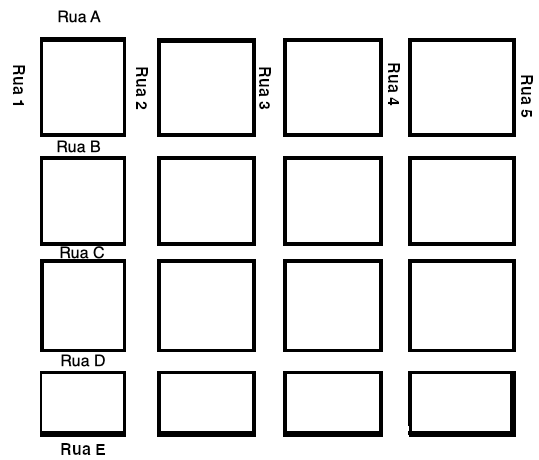
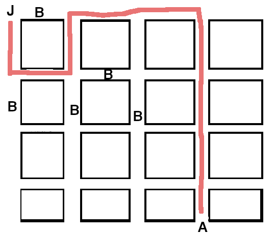
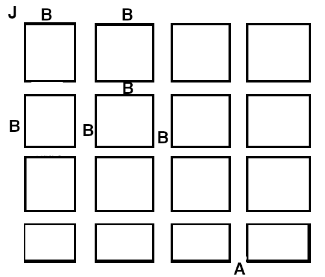

# Encontro Marcado

Após atingir o valor da meta em moedas (e dobrá-la repetidas vezes), Joãozinho
resolveu fazer uma viagem para visitar Aninha, uma grande amiga de longa data.

A cidade onde Aninha mora, Unifacity, foi muito bem planejada e construída,
tendo todas as suas ruas dispostas em formato de matriz, como na figura a
seguir:

###### Foto: Plano original da Unifacity.

Joãozinho acabou de chegar em Unifacity, cuja entrada é no canto superior
esquerdo do mapa, identificado pelas coordenadas (0,0), e precisa navegar no
mapa de Unifacity a fim de encontrar Aninha, atualmente no local identificado
pelas coordenadas (L, C).

Joãozinho notou duas coisas ao chegar na cidade:

1. A cidade havia crescido bastante, e agora possui **N** ruas "verticais" e
   **M** ruas "horizontais".
2. **O-B-R-A-S**. Por ser uma cidade que está sempre em crescimento, é possível
   ver obras em vários trechos das ruas da cidade, o que impede o trânsito
   nestes locais.

Joãozinho ficou apreensivo, por não saber se seria possível chegar até o local
onde se encontra Aninha, e pediu a sua ajuda para encontrar uma rota possível
do ponto (0, 0) ao ponto (L, C), ou se seria impossível fazer tal rota.

Implemente a função _encontra_rota_ que recebe as variáveis:

- **M** - o número de ruas "horizontais" em unifacity;
- **N** - o número de ruas "verticais" em unifacity;
- **L** - parte das coordenadas onde Aninha se encontra;
- **C** - parte das coordenadas onde Aninha se encontra;
- **B** - a localização das obras em Unifacity;

A função deve retornar uma rota a ser seguida para que Joãozinho chegue até
Aninha, ou se é impossível realizar tal navegação.

## Entrada

A entrada consiste das variáveis **M**, **N**, **L**, **C**, e **B**, conforme
descritas anteriormente. A variável **B**, que corresponde à localização das
obras em Unifacity, é um array de tuplas na forma `(LI, CI, LF, CF)`, onde
**LI** e **CI** identificam as coordenadas do início de um trecho de obras, e
**LF** e **CF** identificam as coordenadas do fim de um trecho de obras. Vide
exemplos ilustrados mais abaixo.

## Saída

A função deve retornar uma string que corresponde ao trajeto, indicando a
direção de cada movimento a ser feito por Joãozinho -- Norte (N), SUL (S), Leste
(L) ou Oeste (O) -- desde a posição (0, 0) até chegar em Aninha, ou a palavra
_IMPOSSIVEL_, caso não seja possível que Joãozinho chegue até Aninha.

**Nota:** é possível que exista mais de uma rota possível. Qualquer rota correta
retornada será considerada válida.

## Exemplos

| M   | N   | L   | C   | B                                                                                      | Saída      |
| --- | --- | --- | --- | -------------------------------------------------------------------------------------- | ---------- |
| 5   | 5   | 4   | 3   | \[(0, 0, 0, 1), (1, 1, 1, 2), (1, 0, 2, 0), (1, 1, 2, 1), (1, 2, 2, 2)\]               | SLNLLSSSS  |
| 5   | 5   | 4   | 3   | \[(0, 0, 0, 1), (0, 1, 0, 2), (1, 1, 1, 2), (1, 0, 2, 0), (1, 1, 2, 1), (1, 2, 2, 2)\] | IMPOSSIVEL |

### Explicação

No primeiro caso, temos a seguinte rota:

###### Primeiro exemplo.

**Nota:** Existem outras formas de navegar de Joãozinho até Aninha. Esta é
apenas uma das opções possíveis.

No segundo caso, não existe nenhuma rota possível a ser traçada:

###### Segundo exemplo.

## Dica

Para este problema, a técnica a ser utilizada é de backtracking.
