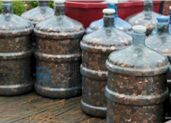

# Moedas

Joãozinho durante vários anos fez uma grande reserva de dinheiro completamente
constituída de moedas. A reserva de Joãozinho pode ser vista na foto a seguir:

###### Foto: Acervo pessoal de Joãozinho.

Volta e meia, Joãozinho gosta de despejar todas as moedas e contar o valor
acumulado nelas até o momento, para tentar determinar se conseguiu alcançar a
sua meta, e dobrar a meta, caso ela tenha sido atingida.

Com o passar do tempo, Joãozinho viu que essa era uma tarefa muito repetitiva e
tediosa, então construiu uma máquina capaz de contar o valor total das moedas,
contanto que elas sejam colocadas em uma fileira única, com o lado que contém o
valor virado para cima.

Essa máquina acelerou bastante o processo de somar o valor total das moedas, mas
ainda tinha uma limitação: Joãozinho precisava garantir que todas as moedas
estivessem com seu valor voltado para cima. Essa também era uma tarefa
repetitiva e tediosa, então Joãozinho construiu uma segunda máquina, capaz de
virar exatamente ***k*** moedas consecutivas (nenhuma a mais, e nenhuma a menos)
de uma única vez, acelerando, assim o processo de deixar todas as moedas com o
valor voltado para cima.

Dada a fileira atual onde se encontram as moedas, determine o número mínimo de
operações de virar moedas que a máquina deve fazer, de modo que todas as moedas
fiquem com o valor voltado para cima, ou se essa é uma tarefa impossível para a
segunda máquina descrita.

Implemente a função *minimo_operacoes* que recebe **D**, a descrição da fileira
de moedas atual, e **K**, o número de moedas consecutivas que a máquina vira a
cada operação, e retorna o mínimo de operações a serem realizadas, ou se é
impossível concluir a tarefa.

## Entrada

A entrada consiste das variáveis **D**, uma cadeia de caracteres indicando se as
moedas estão inicialmente com o valor voltado para cima (indicado pelo caractere
**V**), ou com o valor voltado para baixo (indicado pelo caractere **C**) e
**K**, o número de moedas consecutivas viradas simultaneamente.

## Saída

A função deve retornar o menor número de operações de virar moedas a serem
realizadas, representada por um número inteiro, ou o valor -1, caso não seja
possível deixar todas as moedas com o valor voltado para cima.

## Limites

Limite de memória: 1GB.

Tempo limite: 0.2s.

2 <= Tamanho de D <= 1000.

2 <= K <= Tamanho de D.

## Exemplos

D | K | Saída
--- | --- | ---
CCCVCVVC | 3 | 3
VVVVV | 4 | 0
CVCVC | 4 | -1

### Explicação

No primeiro caso, podemos proceder da seguinte forma:
1. Virar as três primeiras moedas, ficando com VVVVCVVC;
2. Virar as três últimas moedas, ficando com VVVVCCCV;
3. Virar as três moedas consecutivas que ainda estão com o lado do valor
voltados para baixo;

Existem outras formas de chegar a esse mesmo resultado com 3 ou mais operações,
porém não é possível com menos de 3 operações, por isso, esta é a saída da
função.

No segundo caso, todas as moedas já estão com o valor voltado para cima, logo,
não é necessário realizar nenhuma operação para concluir a tarefa.

No último caso, não existe nenhuma sequência de operações que deixe todas as
moedas com o valor voltado para cima.

## Dica

Para este problema, a técnica a ser utilizada é do algoritmo guloso.